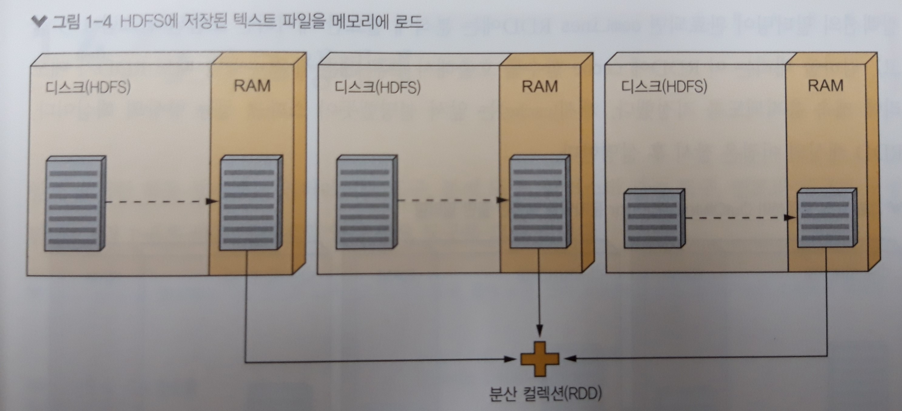

# 스파크 프로그램의 실행 과정

스파크를 하둡의 HDFS 에서 실행시킨다고 가정하고 설명한다.
300MB 크기의 로그 파일이 노드 3개로 구성된 HDFS 클러스터에 분산 저장되어 있다고 하자. HDFS는 이 파일을 자동으로 128MB 크기의 청크(chunk) 로 분할하고(하둡에서는 block 이라는 용어를 사용한다), 각 블록을 클러스터의 여러 노드에 나누어 저장한다. 


스파크는 데이터 지역성(data locality)을 최대한 달성하려고 로그 파일의 각 블록이 저장된 위치를 하둡에게 요청한 후, 모든 블록을 클러스터 노드의 RAM 메모리로 전송한다. 데이터 전송이 완료되면 스파크 셸에서 RAM에 저장된 각 블록이 저장된 위치를 하둡에게 요청한 후, 모든 블록을 클러스터 노드의 RAM 메모리로 전송한다.



데이터 전송이 완료되면 스파크 셸에서 RAM에 저장된 각 블록(이를 스파크 용어로 파티션 이라고 한다)을 참조할 수 있다. 이 블록, 즉 파티션의 집합이 바로 RDD가 참조하는 분산 컬렉션이며, 이 컬렉션에는 분석해야 할 로그파일 줄(line)이 저장되어 있다.

간단히 말해, RDD를 사용하면, 비-분산(non-distributed) 로컬 컬렉션을 처리하는 것과 같은 방식으로 대규모 분산 컬렉션을 다룰 수 있다. 사용자는 컬렉션이 분산 저장된다는 사실을 굳이 알 필요가 없고, 노드 장애애 대비할 필요도 없다. 


RDD를 확보한 후 이 RDD에서 OutOfMemoryError 문자열을 포함하지 않는 모든 줄을 제거해 오류 개수를 계산하고자 한다. 이 작업은 filter 함수를 호출해서 해결할 수 있다.

``` scala
val oomLines = lines.filter(l => l.contains("OutOfMemoryError")).cache()
```

컬렉션의 필터링이 완료되면 oomLines RDD에는 분석에 필요한 데이터만 포함된다.
코드를 살펴보면, RDD에 cache 함수를 호출해서 추후 다른 job을 수행할 때도 RDD가 메모리에 계속 유지되도록 지정했다. 캐시는 스파크 성능 향상의 핵심이다. HDFS의 로그파일을 다시 로드하는 대신 캐시의 데이터를 재사용할 수 있기 때문이다. (이 예제에서는 간단한 설명을 위해 여러 줄에서 OutOfMemoryError 문자열을 출력할 가능성은 없다고 가정했다.) 


## 출처

스파크를 다루는 기술 - 길벗