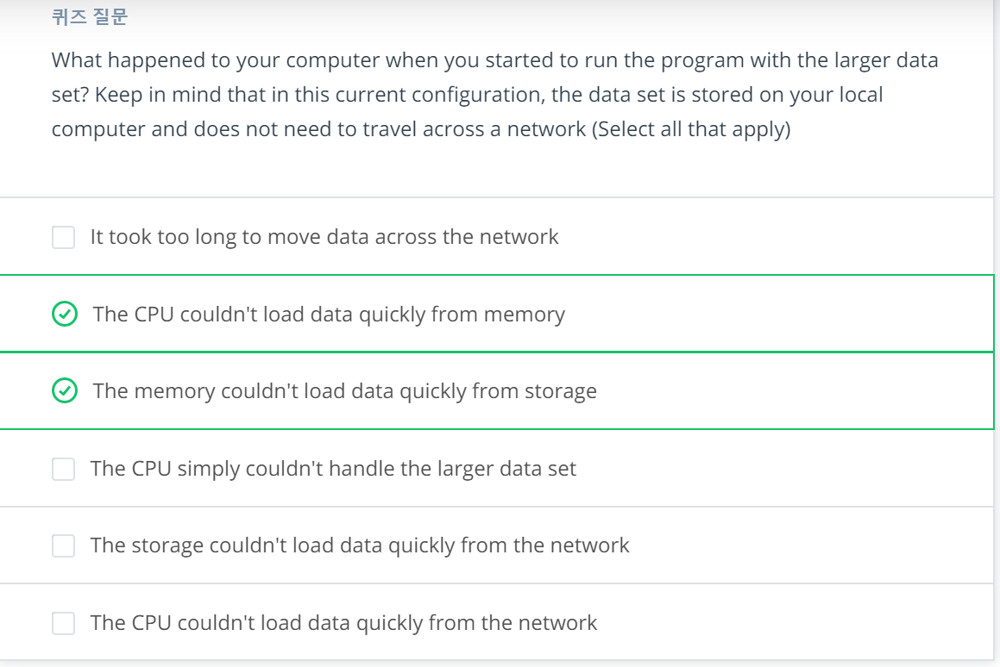
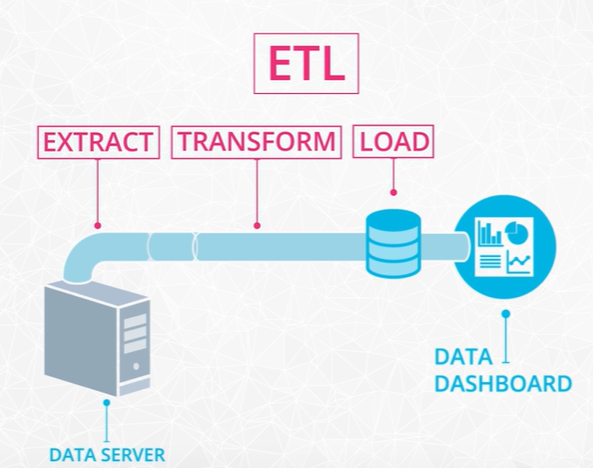

#### big data numbers part1

퀴즈 내용이 이해를 많이 도울 수 있을 것 같다. 비전공자들에게.

#### big data numbers part2

처음에는 storage, memory, cpu를 순차적으로 조금 사용하겠지만 시간이 흐를수록 IO가 많아지면서 디스크와 메모리의 사용량이 꽉 차게 될 것이다.

분산환경으로 한다면 필요한 만큼만 다운로드 받을 수 있도록 하는 것이다. 

#### Medium data numbers

처리는 나누어서 한다 할지라도 다시 모일 때 큰 데이터가 된다면 하나의 머신에서 그것을 다루기란 쉽지 않을 것이다. 그래서 그 파일들을 나누어야하는데 여기서 여러가지 트릭이 있을 수 있다. 가장 간단한 트릭이 있다면, 이름 순으로 정렬할 때는 A-M, N-Z 식으로 파일을 나눈다면 가능할 것이다.

#### History of Distributed and Parallel Computing

분산환경은 하나의 머신들이 그래프 자료구조의 노드가 되고 각각은 독자적인 cpu와 메모리를 가지고 있는 것이다. parallel 은 하나의 메모리를 여러 cpu가 공유하며 처리하는 것을 말한다.

#### The Hadoop Ecosystem

hadoop은 4개의 주요 기능을 가지고 있다.

##### 다른 빅데이터 프로젝트들

apache pig : 야후에서 만듦 ad-hoc 맵리듀스 작업을 SQL과 비슷한 언어로 할 수 있도록 함 

apache hive : SQL로 data summarization, query, analysis를 할 수 있는 인터페이스 제공

##### 전통적인 맵리듀스 approach의 문제점

1. 중간결과들이 디스크에 저장됨 (디스크IO가 많아져서 속도가 느려짐) 
   -> spark는 디스크에 저장하는 것이 아니라 메모리에 저장해서 속도가 빠르다.

##### streaming data를 위한 아파치 프로젝트

- apache storm
- apache flink

이 두 라이브러리들은 아파치 스트리밍 라이브러리들과 함께 수행할 수 있다.

#### MapReduce

Map, shuffle, Reduce의 단계가 있다.

#### The Spark Cluster

standalone 매니저로도 클러스터 구성이 가능하다고 한다. Lesson 3.

#### Spark use case

1. ETLing (현업에서 동사화되었다고 한다.)

2. 빅데이터에서 머신러닝모델을 돌릴 때

스파크는 iterative algorithm에 특히 유용하다. Logistic regression, page rank

