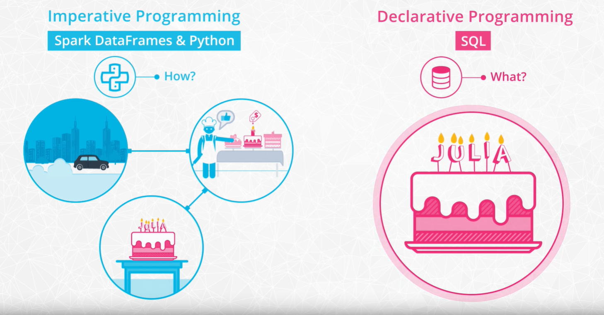
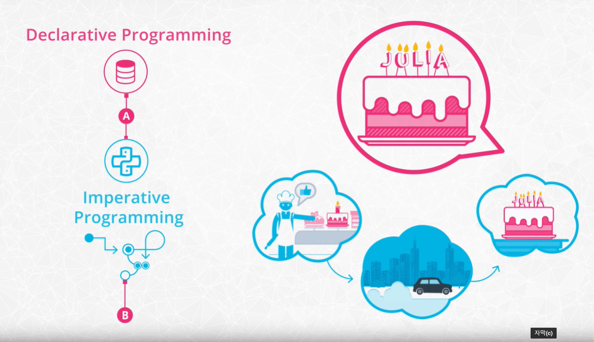
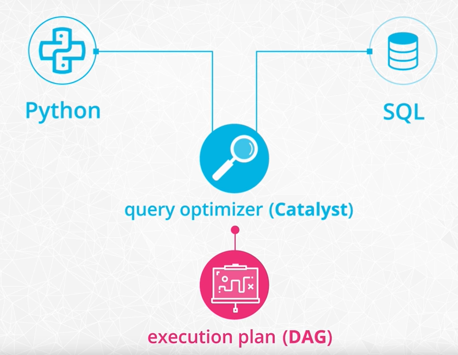

#### Introduction

- wrangling data
- functional programming
- read in and write out data
- spark environment and APIs
- RDDs

#### Functional Programming

spark는 scala로 쓰였다.

파이썬 API로 pyspark를 지원해준다.

파이썬은 원래 절차형 언어지만 툴을 지원해준다는 것이다.

#### Why use functional programming

분산환경에서 좋은 성능을 발휘한다. 함수를 정의해놓으면 그것을 사용하기 간편하기 때문이다.

#### Pure Functions Analogy

빵 공장으로 비유한다. 

함수는 하나의 기계에 대입할 수 있다.    

주의할 점은 부작용을 일으키지 않는 것이며, 이를 위해서는 pure function이어야 한다.

##### Pure Function(순수 함수)

함수는 주어진 입력으로 계산하는 것 외에 프로그램의 실행에 영향을 미치지 않아야 하며, 이를 부수효과(side effect)가 없어야 한다고 한다. 이러한 함수를 순수 함수라고 한다.

#### DAG (Directed Acyclical Graph)

각각의 Spark function은 input data의 copy를 가지고 있다.
하지만 오리지날은 절대 수정되지 않는다.

#### lambda function

http://palmstroem.blogspot.com/2012/05/lambda-calculus-for-absolute-dummies.html

람다 함수 사용법 : https://offbyone.tistory.com/73

Maps : input data 의 복사본을 만들고 그 복사본을 map 안에 넣은 함수에 대입시켜준다.

람다함수 : 콜론 왼쪽은 입력값 오른쪽은 작동방식 

#### Data Formats

- CSV : comma로 구분된 파일 형식
- JSON(JavaScript Object Notation) : 네트워크를 통해 데이터를 주고받는 데 자주 사용되는 경량의 데이터 형식  http://www.json.org/json-ko.html 브라우저-서버간 통신에 쓰인다
- HTML : 웹페이지를 이루는 파일 형식 
- XML : 사람이 읽을 수 있고 사용자가 자신만의 태그를 정의하여 사용할 수 있다.

#### Spark Session

SparkContext는 spark 기능의 main entry point 이며, 

클러스터와  application을 연결한다.

getOrCreate메소드는  SparkSession 이 이미 돌아가고 있을 경우, 새로운걸 만드는 대신 이미 돌아가고 있던 것을 리턴하지만, 그 외의 환경설정은 새로 입력한 변수들로 채워준다.

#### Reading and Writing Data into Spark Data Frames

실습파일을 구할 수 없어서 로컬에서 실행이 불가능했다. 데이터를 제공하지 않음.

#### Imperative Programming VS Declarative Programming

#### 

Declarative Programming 은 무엇을 원하는가? 에 초점이 맞춰진 방식
Imperative Programming 은 어떻게 원하는 것을 가져올거냐는 절차를 말한다.

Declarative system 들은 Imperative system의 추상화계층으로, Declarative계층에서 julia가 좋아하는 케잌을 준비하자! 라고 하면 Imperative 계층에서 베이커리를 찾아서 운전을 해서 사오는 것과 비슷하다.

#### SPARK SQL

SPARK의 DataFrame을 MySQL처럼 SQL언어를 통해 다룰 수 있다.

##### resources

Here are a few resources that you might find helpful when working with Spark SQL

- [Spark SQL built-in functions](https://spark.apache.org/docs/latest/api/sql/index.html)
- [Spark SQL guide](https://spark.apache.org/docs/latest/sql-getting-started.html)

##### Quiz - lab3-24,25,26

퀴즈 문제가 있다. dataset만 구할 수 있다면 문제는 상당히 괜찮아보인다.

#### RDD API

지금까지 데이터를 Python과 SQL로 다뤘다. 
pyspark로 짜든 SQL로 짜든 코드들은 모두 query optimizer로 들어가서 execution plan 으로 바뀐다.

RDD를 다룬다는 것은 Imperative programming보다 더 디테일한 작업이 가능해지는 것을 의미한다.
차를 타고 케잌을 골라서 사온다. 가 Imperative였다면 RDD는 차키를 넣고 시동을 걸고... 수준으로 디테일 해진다고 생각하면 된다.

#### 추가 공부가 필요한 것

Pure function

Lazy Evaluation

lambda function

