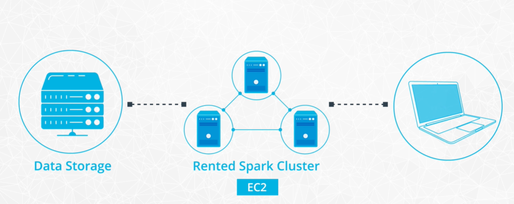

## Introduction

spark의 장점을 모두 사용하기 위해서는 분산환경이 필요하다.

하지만 distributed mode를 사용하는 것은 언제나 straight forward한 것이 아니다. 실패를 불러올 수 있다.

그래서 debugging, optimization을 배워야 할 필요가 있다.

#### Overview

- 아마존 aws를 이용하여 분산환경을 구성한다.
- Spark WebUI를 이용하여 디버깅을 해본다.

스파크를 클러스터환경에서 돌려보고 예상한대로 스파크 프로그램이 동작하지 않을 때 어떻게 대처할지를 배우자

## From Local to Standalone Mode

스파크의 클러스터 매니저는 3가지가 있다.

1. Standalone Mode
2. Mesos
3. Yarn

Mesos와 Yarn은 팀 협업을 할 때 많이 쓴다. 이 강의에서는 Standalone모드를 쓸 예정이라고 한다.

데이터가 작다면 하나의 컴퓨터에서 데이터를 ssd에서 메모리로 가져오고 cpu에서 연산하는 모든 과정이 이루어질 것이다. 하지만 빅데이터이기 때문에 컴퓨터가 여러 대 필요하게 된다.

여러 머신을 구비하는 것은 현실적으로 어렵다. 이 강의에서는 스토리지는 아마존 s3, 컴퓨팅은 ec2를 활용하여 클러스터 환경을 구축한다.

- Lec4-3~5 까지 아마존 AWS로 클러스터환경을 구축한다. 
- 과금이 얼마나 되는건지 모르겠다.
- 그리고 스파크 클러스터를 처음 컴퓨팅환경을 구축할 때 옵션으로 클릭해서 구축해버리기 때문에 정확히 클러스터가 어떻게 구축되는 것인지에 대한 이론적 배경을 알 수 없었다.
- 독학을 위해 책이 필요하다는 생각이 들었다.